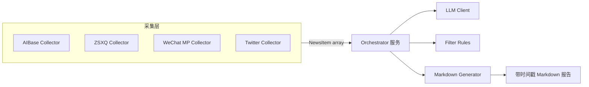

# AI 新闻采集器


轻量级 AI 新闻采集器, 聚合多平台的前沿 AI 资讯, 通过 LLM 智能筛选后输出结构化报告, 帮助团队和个人以更低成本维护信息优势。

> ✨ **愿景**: 打造开源、易扩展的 AI 新闻枢纽, 让社区可以快速接入新的数据源、共享过滤策略, 共同追踪全球 AI 动态。

## 目录

- [功能特性](#功能特性)
- [快速开始](#快速开始)
  - [环境要求](#1-环境要求)
  - [安装依赖](#2-安装依赖)
  - [配置环境变量](#3-配置环境变量)
  - [配置过滤规则](#4-配置过滤规则)
  - [运行程序](#5-运行程序)
- [项目结构与架构](#项目结构与架构)
- [配置说明](#配置说明)
- [测试与质量保障](#测试与质量保障)
- [常见问题](#常见问题)
- [技术栈](#技术栈)
- [贡献指南](#贡献指南)
- [路线图](#路线图)
- [开发](#开发)
- [License](#license)
- [支持](#支持)

## 功能特性

- ✅ **多数据源采集**: 支持 AIBase、知识星球、微信公众号和 Twitter,可按需扩展更多来源
- ✅ **智能采集**: 自动抓取最新 AI 新闻和社群讨论
- ✅ **微信公众号采集**: 通过二维码扫码登录,零配置采集公众号文章
- ✅ **Twitter 采集**: 基于 Composio 一键接入,支持关注推主与关键词搜索
- ✅ **LLM 评分**: 使用 DeepSeek API 根据用户偏好对内容进行智能评分
- ✅ **动态过滤**: 自动保留得分最高的 10-30% 内容
- ✅ **配置化**: 通过 JSON 配置文件设置正反面样例
- ✅ **低成本**: 使用 DeepSeek API,每次运行约 $0.01-0.02
- ✅ **完整日志**: 彩色日志输出,清晰展示采集和过滤进度
- ✅ **按源分组**: Markdown 报告按数据源分组展示
- 🆕 **统一时间窗口**: `config/collection-window.json` 一次性控制所有数据源的采集天数

## 快速开始

### 1. 环境要求

- Node.js 18+ (LTS 版本)
- DeepSeek API Key ([获取地址](https://platform.deepseek.com/api_keys))
- (可选) 知识星球 Cookie - 如需采集知识星球内容
- (可选) 微信公众号 Token/Cookie - 如需采集公众号文章(个人订阅号即可)
- (可选) Composio API Key + Twitter 连接 ID/user_id - 如需采集 Twitter 资讯

### 2. 安装依赖

```bash
npm install
```

### 3. 配置环境变量

复制 \`.env.example\` 到 \`.env\` 并填入你的 API Key:

```bash
cp .env.example .env
```

编辑 \`.env\` 文件:

```env
DEEPSEEK_API_KEY=sk-xxxxxxxxxxxxxxxxxxxxxxxx

# 可选: Twitter 采集所需的 Composio 凭证
# COMPOSIO_API_KEY=ak_xxxxxxxxxxxxx
# COMPOSIO_CONNECTION_ID=ca_xxxxxxxxxxxxx
# COMPOSIO_USER_ID=pg-test-xxxxxxxxxxxxxxx

# 可选:知识星球 Cookie (如需采集知识星球内容)
# ZSXQ_COOKIE=your_zsxq_cookie_here
```

**获取知识星球 Cookie**:
1. 浏览器登录 https://wx.zsxq.com
2. 打开开发者工具 (F12) -> Network 标签
3. 刷新页面,找到请求 `https://api.zsxq.com` 开头的请求(例如 topics 请求)
4. 点击该请求,在右侧 Headers 面板中找到 "Cookie:" 请求头
5. 复制完整的 Cookie 值(必须包含 `zsxq_access_token` 字段)
6. 将复制的 Cookie 粘贴到 `.env` 文件中

**注意**:
- 不要使用 `document.cookie`,因为 `zsxq_access_token` 是 HttpOnly Cookie,无法通过 JavaScript 访问
- Cookie 示例格式: `zsxq_access_token=xxxxxxxxxx; sensorsdata2015jssdkcross=xxxxxxxxxx; abtest_env=product`

**配置微信公众号采集**(可选):

**第一步: 获取 Token 和 Cookie**

1. 浏览器登录微信公众号后台 https://mp.weixin.qq.com/
2. 打开浏览器开发者工具 (F12 或 Command+Option+I)
3. 从 URL 中复制 `token` 参数
4. 从 Network → Headers → Cookie 中复制完整的 Cookie 值
5. 添加到 `.env` 文件

详细图文教程: [如何获取微信公众号 Token 和 Cookie](docs/how-to-get-wechat-token.md)

**快速配置**:

编辑 `.env` 文件,添加以下配置:
```bash
WECHAT_TOKEN=你的token值
WECHAT_COOKIE=完整的cookie字符串
```

示例:
```bash
WECHAT_TOKEN=1234567890
WECHAT_COOKIE=slave_user=gh_xxxxx; slave_sid=xxxxx; bizuin=xxxxx
```

**第二步: 配置要采集的公众号**

编辑 `config/wechat-accounts.json` 文件:

```bash
# 如果文件不存在,从示例文件复制
cp config/wechat-accounts.example.json config/wechat-accounts.json

# 编辑配置
vim config/wechat-accounts.json
```

添加要采集的公众号:
```json
[
  {
    "fakeid": "MzI1NjIyMTAwMA==",
    "nickname": "AI科技评论"
  },
  {
    "fakeid": "MzUxOTU3NjE4MA==",
    "nickname": "量子位"
  }
]
```

**如何获取 Fakeid**:
1. 登录你的公众号后台 https://mp.weixin.qq.com/
2. 进入"素材管理" → "新建图文消息"
3. 点击"超链接" → "文章链接"
4. 搜索目标公众号名称
5. 打开 DevTools (F12) → Network 标签
6. 从请求 URL 中复制 `fakeid` 参数

**注意**: Token 有效期约 7 天,过期后需要重新获取

**配置 Twitter 采集**(可选):

1. 登录 [Composio 控制台](https://app.composio.dev/),在 Settings → API Keys 中创建 API Key 并写入 `.env`。
2. 在 Connections 页面搜索 Twitter,完成 OAuth 授权后复制 Connection ID(`ca_xxx`)。
3. 运行 `npm run composio:connection` 或查看连接详情,将输出的 `user_id` 填入 `.env` 的 `COMPOSIO_USER_ID`。
4. 复制示例配置: `cp config/twitter-accounts.example.json config/twitter-accounts.json`
5. 编辑 `config/twitter-accounts.json`,填写需要关注的推主。未配置推主时会使用 `keywords` 列表进行回退搜索。

### 4. 配置过滤规则

为每个启用的数据源准备独立的过滤配置,示例文件位于 `config/filter-rules-*.json`。
请至少补充你要使用的数据源对应的文件,结构一致:

```json
{
  "positiveExamples": [
    {
      "title": "你想看到的新闻类型的标题",
      "summary": "新闻摘要(100-200字符)",
      "reason": "为什么喜欢这类新闻"
    }
  ],
  "negativeExamples": [
    {
      "title": "你不想看到的新闻类型的标题",
      "summary": "新闻摘要(100-200字符)",
      "reason": "为什么不喜欢这类新闻"
    }
  ]
}
```

### 5. 运行程序

```bash
npm start
```

程序会自动:
1. 读取启用的数据源配置 (AIBase / 知识星球 / 微信公众号 / Twitter)
2. 统一应用采集时间窗口、并发控制等运行参数
3. 使用 DeepSeek LLM 结合正负向样例进行批量评分
4. 根据动态阈值保留重点新闻
5. 生成带时间戳的 Markdown 报告(示例: `output/filtered-news-20251102-223726.md`), 每个数据源以表格方式呈现

> 📄 **输出示例 (节选)**

```markdown
| 来源 | 标题 | 摘要 | 得分 | 互动指标 |
|------|------|------|------|----------|
| WeChat-MP · AI科技评论 | 百度推出的 AI 播客平台 | 一键将文字转换为播客, 支持多音色与字幕编辑, 快速生成高质量节目。 | 4.5 | 阅读量: 2.3万 |
| Twitter · AnthropicAI | Claude 代码助手正式发布 | 新增原生安装器, 稳定性提升并移除 Node.js 依赖。 | 4.2 | 点赞: 3.1k / 转推: 520 |
```

## 项目结构与架构

```
ai-news-collector/
├── src/
│   ├── collectors/       # 数据采集器
│   │   ├── base.js      # 采集器基类
│   │   ├── aibase.js    # AIBase 采集器
│   │   ├── zsxq.js      # 知识星球采集器
│   │   ├── wechat-mp.js # 微信公众号采集器
│   │   └── twitter.js   # Twitter 采集器
│   ├── services/        # 核心服务
│   │   ├── llm-client.js    # LLM 客户端
│   │   ├── orchestrator.js  # 流程编排器
│   │   └── retry.js     # 重试机制
│   ├── models/          # 数据模型
│   │   └── news-item.js # 新闻条目模型
│   ├── config/          # 配置管理
│   │   ├── loader.js    # 配置加载器
│   │   └── datasources.js  # 数据源配置
│   ├── output/          # 输出模块
│   │   └── markdown.js  # Markdown 生成器
│   ├── utils/           # 工具类
│   │   └── logger.js    # 日志工具
│   └── index.js         # CLI 入口
├── config/              # 配置文件
│   ├── filter-rules-*.json        # 各数据源过滤规则
│   ├── wechat-accounts.json       # 微信公众号列表(默认忽略提交)
│   ├── twitter-accounts.json      # Twitter 推主配置
│   └── zsxq-groups.json           # 知识星球星球与话题配置
├── scripts/             # 实用脚本
│   ├── composio-connection-info.js # 辅助查询连接 user_id
│   └── twitter-demo.js            # Twitter 采集 Demo
├── output/              # 输出目录(自动保存带时间戳的 Markdown 报告)
├── .env.example         # 环境变量示例
└── package.json
```



各模块职责概览:

- **Collectors**: 针对具体来源实现采集逻辑, 统一返回 `NewsItem` 数据结构。
- **Orchestrator**: 协调采集结果、批量评分与动态阈值过滤。
- **LLM Client**: 封装 DeepSeek API 调用、批次切分与重试机制。
- **Markdown Generator**: 负责将筛选后的新闻渲染为表格化周报与统计摘要。
- **Config Loader & Validators**: 统一读取 JSON 配置并提供结构化校验。

## 配置说明

### 环境变量

| 变量名 | 必填 | 默认值 | 说明 |
|--------|------|--------|------|
| DEEPSEEK_API_KEY | 是 | - | DeepSeek API 密钥 |
| COMPOSIO_API_KEY | 否 | - | Composio API Key, 用于调用 Twitter 工具 |
| COMPOSIO_CONNECTION_ID | 否 | - | Composio Twitter 连接 ID, 形如 `ca_xxx` |
| COMPOSIO_USER_ID | 否 | - | 连接对应的 `user_id`, 可通过 `npm run composio:connection` 获取 |
| ZSXQ_COOKIE | 否 | - | 知识星球 Cookie (采集知识星球时需要) |
| LLM_MODEL | 否 | deepseek-chat | 使用的模型 |
| LLM_MAX_TOKENS | 否 | 500 | 最大输出 token 数 |
| LLM_TEMPERATURE | 否 | 0.7 | 温度参数 |

### 数据源配置

配置文件: \`src/config/datasources.js\`

**启用/禁用数据源**:
- 修改对应配置的 \`enabled\` 字段为 \`true\` 或 \`false\`
- 例如,禁用知识星球: 将 \`ZSXQ_CONFIG.enabled\` 设为 \`false\`

**配置知识星球**:
- 在 `ZSXQ_CONFIG.config.groups` 中添加星球与话题, `groupId`/`hashtags[].id` 可从星球 URL 及接口返回中获取
- ⚠️ 知识星球话题接口单次最多返回 20 条, 程序会按 `maxItems` 自动分页采集
- 详细图文步骤见 [docs/setting-up-zsxq.md](docs/setting-up-zsxq.md)

**配置 Twitter**:
- 在 `TWITTER_CONFIG` 中开启 `enabled`,并确保 `.env` 中填入 Composio 凭证
- `config/twitter-accounts.json` 控制推主和关键词,默认每个推主/关键词最多保留 10 条
- 可通过 `maxItemsPerAccount`/`maxItemsPerKeyword` 自定义配额,全局总量会自动扩容
- 未配置推主时会回退到 `keywords` 列表执行搜索
- 时间窗口由 `config/collection-window.json` 控制,`twitter-accounts.json` 中的 `sinceHours` 字段仅保留向后兼容

### 全局采集时间窗口

- 所有数据源共用 `config/collection-window.json` 中的 `recentDays` 值,默认 7 天
- 修改该文件即可统一调整采集范围,无需分别修改各个数据源配置
- 如果配置缺失或数值无效,程序会回退到默认的 7 天并在日志中提示

### 过滤规则配置
每个数据源都有独立的过滤规则文件(位于 `config/filter-rules-*.json`):

- **positiveExamples**: 正面样例(至少 1 个),表示你想看到的新闻类型
- **negativeExamples**: 反面样例(至少 1 个),表示你不想看到的新闻类型
- **thresholdConfig**: 阈值配置
  - `minPercentage`: 最少保留百分比(默认 10%)
  - `maxPercentage`: 最多保留百分比(默认 30%)
  - `preferredCount`: 期望保留数量(默认 15 条)
- (可选) `keywords`: 若某些数据源需要额外关键词筛选,可按原格式添加

### 样例要求

- 标题: 必填,1-200 字符
- 摘要: 必填,**100-200 字符**(严格要求)
- 理由: 可选,说明为什么喜欢/不喜欢

## 测试与质量保障

- 单元测试: `npm test`
- 覆盖率报告: `npm run test:coverage`
- Twitter 采集联调: `npm run demo:twitter`

> ✅ 在提交 PR 之前请至少运行一次 `npm test`, 并在描述中留下测试结果或截图。

## 成本估算

使用 DeepSeek API 的成本极低:

- Input tokens: $0.27 / 1M tokens
- Output tokens: $1.10 / 1M tokens
- Cache hit tokens: $0.027 / 1M tokens (仅 10%)

**预估成本**: 按默认配置(每个数据源约 10 条,总数 40-60 条)运行一次完整流程,成本约 **$0.05-0.10**

## 常见问题

### 1. 如何启用/禁用数据源?

编辑 \`src/config/datasources.js\`:
- 设置 \`AIBASE_CONFIG.enabled = false\` 禁用 AIBase
- 设置 \`ZSXQ_CONFIG.enabled = false\` 禁用知识星球
- 设置 \`TWITTER_CONFIG.enabled = true\` 启用 Twitter(需同步配置 Composio 凭证和推主列表)

### 2. 知识星球采集失败怎么办?

检查:
1. \`ZSXQ_COOKIE\` 是否正确设置
2. Cookie 是否过期(需要重新获取)
3. 账号是否有权访问配置的星球
4. 星球 ID 和标签名称是否正确

查看日志获取详细错误信息。

### 3. 为什么采集不到新闻?

可能的原因:
- 网站结构发生变化
- 网络连接问题
- HTML 选择器需要更新
- Cookie 认证失败(知识星球)

可以查看日志获取详细错误信息。

### 4. LLM 评分失败怎么办?

检查:
1. \`DEEPSEEK_API_KEY\` 是否正确
2. API 密钥是否有余额
3. 网络是否可以访问 DeepSeek API

### 5. 如何调整过滤阈值?

编辑对应数据源的 `config/filter-rules-*.json` 中的 `thresholdConfig`:
- 想要更多新闻: 增大 \`maxPercentage\` 或 \`preferredCount\`
- 想要更少但更精准: 减小 \`minPercentage\` 或 \`preferredCount\`

### 6. 如何添加更多知识星球?

编辑 \`src/config/datasources.js\` 中的 \`ZSXQ_CONFIG.config.groups\`,添加新的星球配置:
```javascript
{
  groupId: 'your_group_id',     // 从星球URL中提取
  groupName: '星球名称',
  hashtags: [
    { id: '15555541155522', name: 'AI风向标' },
    { id: '15555541155523', name: '中标' }
  ]
}
```

## 技术栈

- **运行时**: Node.js 18+ (ESM)
- **LLM**: DeepSeek API (使用 OpenAI SDK)
- **网页抓取**: Cheerio + Axios
- **工具库**: dotenv, string-similarity

## 贡献指南

我们采用 [OpenSpec](openspec/AGENTS.md) 协议化协作流程, 欢迎社区贡献者参与:

1. Fork 仓库并基于 `main` 创建特性分支 (命名建议 `feature/<topic>` )。
2. 使用 `openspec list` 了解现有提案或通过 `openspec create` 撰写新的变更说明。
3. 在改动前运行 `npm install`, 遵循项目编码规范与中文注释约定。
4. 提交前执行 `npm test`, 并在 PR 描述中说明修改动机、测试结果和影响面。
5. 遇到问题可通过 Issue / Discussions 反馈, 也欢迎贡献新的数据源、过滤策略或文档。

## 路线图

- [ ] 接入 GitHub Trending、Hacker News、Reddit 等开源情报源
- [ ] 引入 CI 流水线并公开测试覆盖率徽章
- [ ] 提供可选的 Docker 镜像与一键部署方案
- [ ] 构建历史数据存储与可视化 Dashboard

## 开发

### 调试模式

设置环境变量 \`DEBUG=1\` 可以查看更详细的日志。

### 添加新的数据源

1. 继承 \`BaseCollector\` 类
2. 实现 \`collect()\` 方法
3. 返回 \`NewsItem[]\` 数组
4. 在 \`datasources.js\` 注册

## License

MIT

## 支持

如有问题,请在 GitHub Issues 提交反馈。
